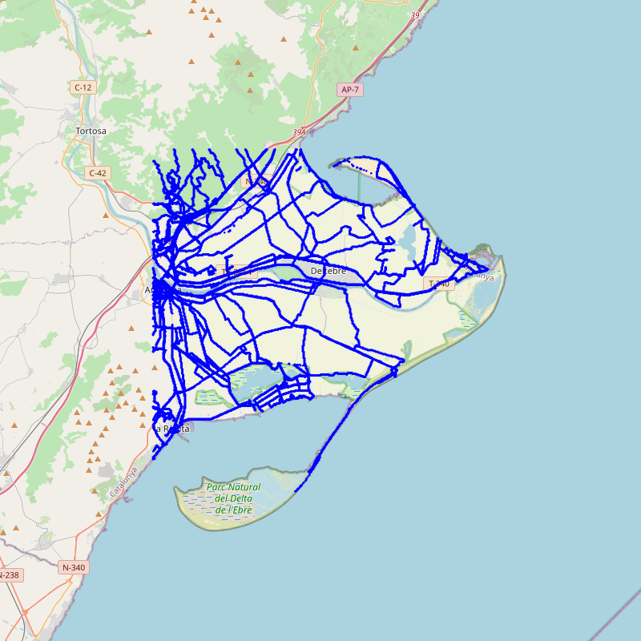
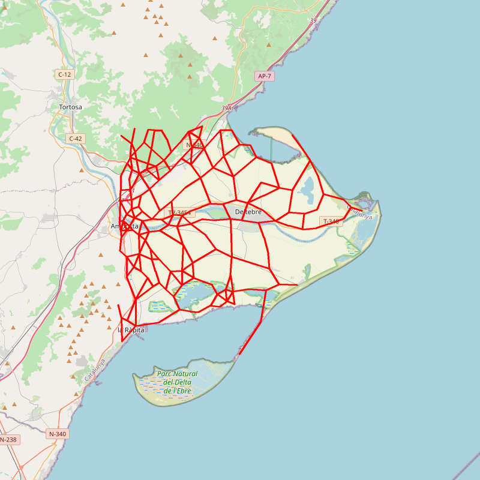
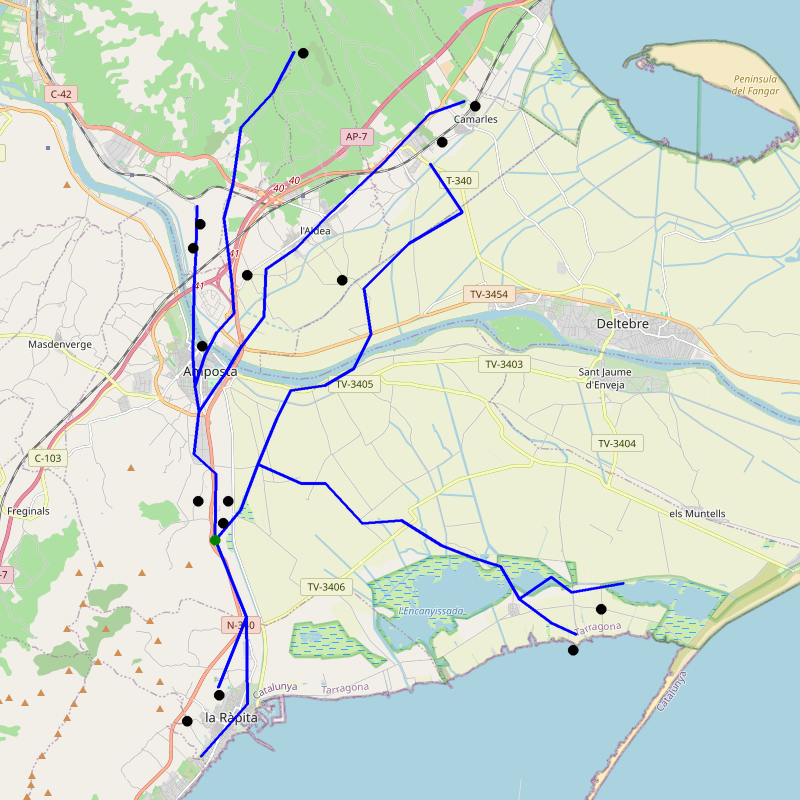

# Pràctica GCED-AP2 2024 · Rutes i monuments

### Eloi Pagès i Adrià Blancafort

## Instalació i execució

Per executar aquest projecte cal seguir els següents passos en ordre:

- Descomprimir el zip
- Instalar totes les llibreries especificades en requirements.txt
- Executar el main.py -> python3 main.py
- Intereccionar amb la consola seguint les instruccions donades pel programa

## Objectiu del projecte

Aquest projecte té com a objectiu ajudar els senderistes a trobar els camins més curts des del punt del mapa on estan fins els monuments de la zona especificada.

## Obtenció i neteja de les dades    

Les dades dels monuments s'obtenen scrapejant les 3200 pàgines de monuments de la pàgina web [Catalunya Medieval](https://www.catalunyamedieval.es/). 

El codi monuments.py scrapeja aquestes pàgines, extreu la informació rellevant respecte el monument i la guarda a un fitxer txt anomenat "monuments.dat". 

Per aconseguir les dades sobre les rutes que els senderistes poden seguir descarreguem les dades de senderistes de [OpenStreetMap](https://www.openstreetmap.org/). La funció "download_segments" localitzada a segments.py és la encarregada.

Finalment, ens hem adonar que les dades proporcionades tenen algunes inconsistències. Afortunadament aquests errors són només errors del GPS no fucionant o de bugs en el sistema. Això vol dir que tots els errors venen de "steps" que són físicament impossibles. En el moment que es descarreguen les dades, també es filtren per eliminar segments inconsistents.

### Criteris de filtratge de segments:

- La diferència de temps entre dos punts no ha de superar un temps màxim permès (15 segons)

- La distància entre dos punts no ha de superar una distància màxima permesa. (500 m)

- La diferència de temps entre dos punts no pot ser pràcticament nul·la.


## Idea general sobre la implementació

La idea de l'algorísme és la segúent: Un cop obtingues les dades creem un graph que modelitza totes les rutes que es poden extraure. Amb el graph creat surgeix el problema de que és massa gran i la majoria d'arestes són molt petites. Per arreglar això fem un algorísme de clustering per ajuntar totes els vèrtexs a l'esapai en els vèrtex més significatius. Un cop tenim aquests vèrtexs del clúster creem un graph representatiu de l'anterior usant els vèrtexs del clúster. Aquest serà el graph que usarem per obtenir el camí final usant l'algorisme Dijkstra. L'excursionista pot començar en un punt que no és del graph, llavors les direccions indicades pel programa serà com arribar al punt més proper del monument desitjat que està al graph començant des del node del graph més proper al punt de principi.

### Creació del graph

Per crear el graph, interpretem un punt del mapa amb coordendades (x,y) com un node del graph i un aresta és un camí disponible en el nostre conjunt de dades sobre si un excursionista algun cop ha fet el camí entre (x_1,y_1) i (x_2,y_2).

### Creació del graph Simplificat

Un cop donat el graph general creat pel clústering, volem un graph simplificat que si donats tres grups $g_1-g_2-g_3$, eliminarem $g_2$ si es donen aquestes tres condicions::

- $g_2$ només té dues arestes connectades
- L'angle $\alpha=\measuredangle g_1g_2g_3$ és proper a $180^o$, és a dir, $|180^o-\alpha| < \varepsilon$, on $\varepsilon$ és un paràmetre de l'algorisme (mesurat en graus).

Això crea un graph més petit i igualment representatiu dels camins disponibles pel senderista, sense perdre quasi res d'informació.

### Trobada el camí

Un cop tenim el graf simplificat i tots els punts corresponents al monument, falta trobar els camins optims des del punt inicial que desitji el senderista fins a cada un dels monuments passant per les arestes del graf simplificat. Per fer-ho, hem creat una funció que donat un punt ens retorna el punt del graf més proper a aquest punt. Aquesta funció la fem servir tant per trobar el punt del graf més proper al punt inicial com per trobar el punt del graf més proper a les coordenades de cada monument. Un cop tenim tots aquests punts, per cada combinació de punt inicial, punt final (monument a dins la zona), apliquem l'algorisme Dijkstra per calcular la ruta optima fins aquell monument.

### Visualització

Finalment, el projecte compta amb funcions que permeten visualitzar en PNG i exportar a KML (per veure amb Google Earth) els segments sobre el mapa, el graf sobre el mapa, el graf simplificat sobre el mapa i el graf de rutes optimes entre un punt inicial escollit pel senderista i tots els punts dins la zona escollida pel senderista.

## Esquelet del projecte

## DataClasses

Per organitzar aquest projecte, hem creat vàries dataclasses, entre elles:

**Representa un punt al mapa**

```python
class Point:
    lat: float
    lon: float
```

**Representa la unió de dos punta al mapa, camí entre ells**

```python
class Segment:
    start: Point
    end: Point
```

**Una llista de segments**

```python
Segments: TypeAlias = list[Segment]
```

**Representa una caixa de coordenades al mapa, les delimitacins que volem dibuixar**

```python
class Box:
    bottom_left: Point
    top_right: Point
```

**Representa un monument del mapa amb el seu nom i la seva localització**

```python
class Monument:
    name: str
    location: Point
```

**Llista de monuments**

```python
Monuments: TypeAlias = list[Monument]
```

### mòdul `segments.py`

El mòdel segments té com a objectiu tractar tot el que està relacionat amb els segments. Hi ha funcions per descarregar i guardar els camins: *download_segments*, *write_segments_to_file*, *read_segments_from_file*, *get_segments*, *show_segments*. 
I una fució per filtar els segments segons els criteris de dades errònies ja explicats.

### mòdul `graphmaker.py`

Aquest mòdul és usat per la creació i gestió del graph de dades. Tenim la funció *make_graph* que crea el graph i la funicó *simplify_graph* que el simplifica amb els criteris explicats.

### mòdul `viewer.py`

Aquest mòdul està relacionat amb la visualització del graph, té les funcions que amb les llibreries de visualiltzació permeten exportar KML i PNG per visualitzar el graph que donen com a output els conjunt de les altres funcions.

### mòdul `monuments.py`

El mòdel moments tracta tota la informació relacionada amb els monuments. Els Descarrega, tracta, troba la informació essencial i guarda en un fitxer. En cas de que hi hagi fitxer també té la funció que llegeix les dades ja guardades del fitxer "monuments.dat".

### mòdul `routes.py`

El mòdul routes tracta totes les coses relacionades amb les rutes del graph. Tenim la funció *nearest_node* que busca el node més proper al donat. El *astar_search* que troba el camí més curt i *find_routes* que troba totes les rutes optimes.

### mòdul `main.py`

El mòdul main és l'encarregat de gestionar tota la feina dels altres mòduls en l'odre que es demana en la consola segons l'usuari.

## Exemple de funcionament:

Com a exemple hem agafat la quadrícula de l'ebre. Un cop corregut l'algorísme de filtrat de dades optenim el graph següent:



Sense filtrar les dades hi havia camins que sobrepassaven aigua i rectes de punta a punta de la imatge. Es pot veure clarament a la imatge proporcionada que totes els camins disposibles són raonables i cap passa per llocs que serien inaccesibles per un persona normal. Això vol dir que el procés de neteja de dades està ben fet.

Seguidament, usem l'algorísme de simplificació del graph mitjançant clústers i angles, obtenint el següent mapejat d'informació:



Podem veure a les imatges que el graph simplificat és molt millor que el graph original ja que dona més o menys la mateixa informació mentre que gasta molta menys memòria i és molt més fàcil de treballar amb ell, donant a trobada de rutes molt més ràpidament.


Podem veure el resultat de les rutes òptimes pels monuments del Delte de l'Ebre:



## Fonts d'informació

- [Lliçons de fitxers en Python](https://lliçons.jutge.org/python/fitxers-i-formats.html)

- [Tutorial de NetworkX](https://networkx.github.io/documentation/stable/tutorial.html)

- [Tutorial de Requests](https://realpython.com/python-requests/)

- [Documentació de BeautifulSoup](https://www.crummy.com/software/BeautifulSoup/bs4/doc/)

- [Documentació de simplekml](https://simplekml.readthedocs.io/en/latest/)

- [Documentació de haversine](https://pypi.org/project/haversine/)

- [Documentació de gpxpy](https://github.com/tkrajina/gpxpy)

- [Google Maps](https://github.com/adriablancafort/rutes-i-monuments-practica-ap2.git)