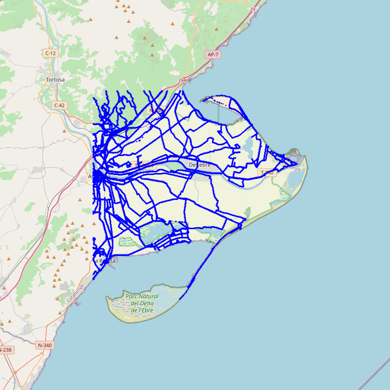
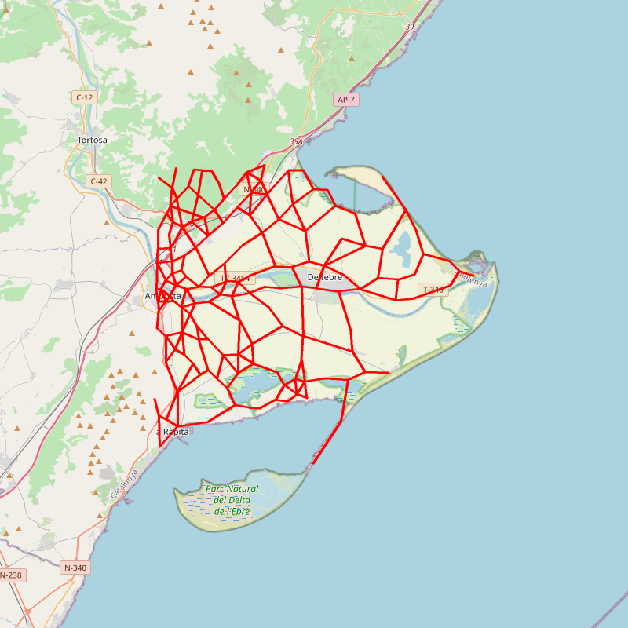

# Pràctica GCED-AP2 2024 · Rutes i monuments

Llegeix les entrades, pregunta què fer i crida les funcions adequades.

## Llibreries
Per executar el projecte calen les següent llibreries::

- typing
- dataclasses
- bs4
- requests
- re
- lxml
- gpxpy
- staticmap
- scikit-learn
- scipy
- numpy
- networkx
- simplekml
- haversine
- math

## Instalació i execució

Per instalar aquest projecte cal seguir els següents passos en ordre:
1: Descomprimir el zip
2: Instalar totes les llibreries especificades en requirements.txt
3: Executar el main.py -> python3 main.py
4: Intereccionar amb la consola seguint les instruccions donades pel programa

## Objectiu del projecte

Aquest projecte té com a objectiu ajudar els senderistes a trobar els camins més curts des del punt del mapa on estan fins el monoment important de la zona més proper.

## Obtenció i neteja de les dades    

Les dades dels monuments s'obtindran a través de [Catalunya Medieval](https://www.catalunyamedieval.es/). El codi localitzat a monuments.py scrapeja una a una les pàgines d'aquesta web, estreu les localitzacions i informació rellevant respecte el monument i la guarda a un fitxer txt anomenat "monuments.dat". Si aquest fitxer està creat en la carpeta de camí relatiu "../" a monuments.py, la funció no torna a escrapejar els monuments, sinó que els llegeix del fitxer. Això evita pèrdues de temps.

Per aconseguir les dades sobre les rutes que els senderistes poden seguir escrapejem una pàgine web de senderisme:[OpenStreetMap](https://www.openstreetmap.org/). La funció "download_segments" localitzada a segments.py fa això. De les dades extrau el temps, i coordenades.

Finalment, ens hem adonar que les dades proporcionades tenen bastants errors. Afortunadament aquests errors són només errors del GPS no fucionant o de bugs en el sistema. Això vol dir que tots els errors venen de "steps" que són físicament impossibles (la persona s'ha mogut massa ràpid i no s'ha mogut). Per això, com a mètode de filtrat de dades, eliminem un segment del conjunt de dades si: Hi ha més de 15 segons entre els dos costats del segment, hi ha més de 500m entre els dos extrems. El temps entre dos segments és molt petit (no s'ha mogut). Això funciona ja que el les dades donades són extretes cada "X" segons, o sigui en intervals de freqüència constant. Això fa que qualsevol cosa que no sigui previsible vol dir que el GPS ha funcionat malament.

## Idea general sobre la implementació

La idea de l'algorísme és la segúent: Un cop obtingues les dades creem un graph que modelitza totes les rutes que es poden extraure. Amb el graph creat surgeix el problema de que és massa gran i la majoria d'arestes són molt petites. Per arreglar això fem un algorísme de clustering per ajuntar totes els vèrtexs a l'esapai en els vèrtex més significatius. Un cop tenim aquests vèrtexs del clúster creem un graph representatiu de l'anterior usant els vèrtexs del clúster. Aquest serà el graph que usarem per obtenir el camí final usant un Djikstra. L'excursionista pot començar en un punt que no és del graph, llavors les direccions indicades pel programa serà com arribar al punt més proper del monument desitjat que està al graph començant des del node del graph més proper al punt de principi.

### Creació del graph
Per crear el graph, interpretem un punt del mapa amb coordendades (x,y) com un node del graph i un aresta és un camí disponible en el nostre conjunt de dades sobre si un excursionista algun cop ha fet el camí entre (x_1,y_1) i (x_2,y_2).
### Creació del graph Simplificat
Un cop donat el graph general creat pel clústering, volem un graph simplificat que si donats tres grups $g_1-g_2-g_3$, eliminarem $g_2$ si es donen aquestes tres condicions::

- $g_2$ només té dues arestes connectades
- L'angle $\alpha=\measuredangle g_1g_2g_3$ és proper a $180^o$, és a dir, $|180^o-\alpha| < \varepsilon$, on $\varepsilon$ és un paràmetre de l'algorisme (mesurat en graus).

Això crea un graph més petit i igualment representatiu dels camins disponibles pel senderista, sense perdre quasi res d'informació.

### Trobada el camí

Per trobar el camí més òptim, trobem el punt més proper al senderista i el punt més proper del graph al monument. Llavors executem un algorísme Djikstra amb node de start el punt del senderista. Això dona el camí més curt entre els dos punts més propers al principi i al final. Se suposa que la densitat de punts és prou bona com perquè el camí trobat sigui prou bo.

## Esquelet del projecte

## DataClasses
Per organitzar aquest projecte, hem creat vàries dataclasses, entre elles:

**Representa un punt al mapa**
class Point:
    lat: float
    lon: float
    def __hash__(self):
        return hash((self.lon, self.lat))

**Representa la unió de dos punta al mapa, camí entre ells**
class Segment:
    start: Point
    end: Point

**Representa una caixa de coordenades al mapa, les delimitacins que volem dibuixar**
class Box:
    bottom_left: Point
    top_right: Point

**Una llista de segments**
Segments: TypeAlias = list[Segment]

**Representa un monument del mapa amb el seu nom i la seva localització**
class Monument:
    name: str
    location: Point

    def __hash__(self):
        return hash((self.name, self.location))

**Llista de monuments**
Monuments: TypeAlias = list[Monument]

**Llista de camins**
Segments: TypeAlias = list[Segment]

### mòdul `segments.py`

El mòdel segments té com a objectiu tractar tot el que està relacionat amb els camins. Hi ha funcions per descarregar i guardar els camins: *download_segments*, *write_segments_to_file*, *read_segments_from_file*, *get_segments*, *show_segments*. 
I una fució per filtar els segments segons els criteris de dades errònies ja explicats.

### mòdul `graphmaker.py`
Aquest mòdul és usat per la creació i gestió del graph de dades. Tenim la funció *make_graph* que crea el graph i la funicó *simplify_graph* que el simplifica amb els criteris explicats.

### mòdul `viewer.py`

Aquest mòdul està relacionat amb la visualització del graph, té les funcions que amb les llibreries de visualiltzació permeten exportar KML i PNG per visualitzar el graph que donen com a output els conjunt de les altres funcions.

### mòdul `monuments.py`

El mòdel moments tracta tota la informació relacionada amb els monuments. Els Descarrega, tracta, troba la informació essencial i guarda en un fitxer. En cas de que hi hagi fitxer també té la funció que llegeix les dades ja guardades del fitxer "monuments.dat".

### mòdul `routes.py`

El mòdul routes tracta totes les coses relacionades amb les rutes del graph. Tenim la funció *nearest_node* que busca el node més proper al donat. El *astar_search* que troba el camí més curt,
### mòdul `main.py`

El mòdul main és l'encarregat de gestionar tota la feina dels altres mòduls en l'odre que es demana en la consola segons l'usuari.

## Exemple de funcionament:

Com a exemple hem agafat la quadrícula de l'ebre. Un cop corregut l'algorísme de filtrat de dades optenim el graph següent:

Sense filtrar les dades hi havia camins que sobrepassaven aigua i rectes de punta a punta de la imatge. Es pot veure clarament a la imatge proporcionada que totes els camins disposibles són raonables i cap passa per llocs que serien inaccesibles per un persona normal. Això vol dir que el procés de neteja de dades està ben fet.

Seguidament, usem l'algorísme de simplificació del graph mitjançant clústers i angles, obtenint el següent mapejat d'informació:

Podem veure a les imatges que el graph simplificat és molt millor que el graph original ja que dona més o menys la mateixa informació mentre que gasta molta menys memòria i és molt més fàcil de treballar amb ell, donant a trobada de rutes molt més ràpidament.
## Fonts d'informació

- [Lliçons de fitxers en Python](https://lliçons.jutge.org/python/fitxers-i-formats.html)

- [Tutorial de NetworkX](https://networkx.github.io/documentation/stable/tutorial.html)

- [Tutorial de Requests](https://realpython.com/python-requests/)

- [Documentació de BeautifulSoup](https://www.crummy.com/software/BeautifulSoup/bs4/doc/)

- [Documentació de simplekml](https://simplekml.readthedocs.io/en/latest/)

- [Documentació de haversine](https://pypi.org/project/haversine/)

- [Documentació de gpxpy](https://github.com/tkrajina/gpxpy)

- [Google Maps](https://github.com/adriablancafort/rutes-i-monuments-practica-ap2.git)

## Autors

- Eloi Pagès 
- Adrià Blancafort

Algorísmia i programació 2